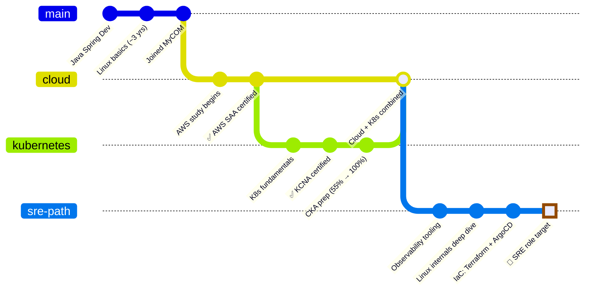
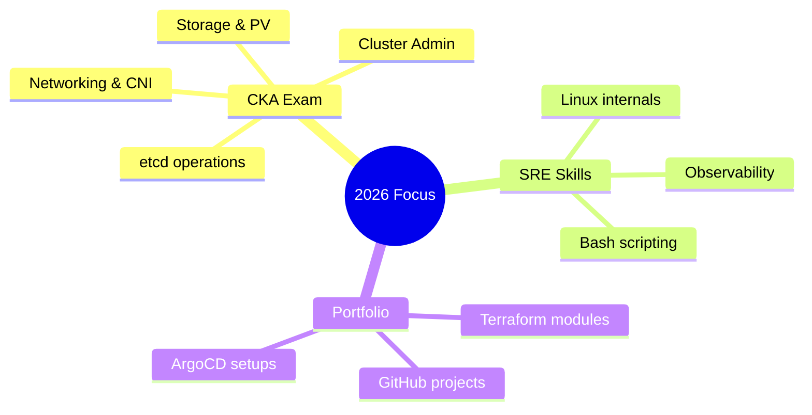
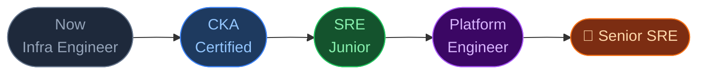

<div align="center">

```
██╗  ██╗██╗   ██╗███╗   ██╗████████╗███████╗██╗   ██╗██╗  ██╗███████╗
██║ ██╔╝██║   ██║████╗  ██║╚══██╔══╝██╔════╝██║   ██║██║ ██╔╝██╔════╝
█████╔╝ ██║   ██║██╔██╗ ██║   ██║   ███████╗██║   ██║█████╔╝ █████╗
██╔═██╗ ██║   ██║██║╚██╗██║   ██║   ╚════██║██║   ██║██╔═██╗ ██╔══╝
██║  ██╗╚██████╔╝██║ ╚████║   ██║   ███████║╚██████╔╝██║  ██╗███████╗
╚═╝  ╚═╝ ╚═════╝ ╚═╝  ╚═══╝   ╚═╝   ╚══════╝ ╚═════╝ ╚═╝  ╚═╝╚══════╝
```

**Infrastructure & Platform Engineer in Progress**
`Japan` · `MyCOM` · `SRE路線`

[](https://aws.amazon.com/certification/)
[](https://www.cncf.io/certification/kcna/)
[]()

</div>

---

## `$ whoami`

```yaml
name: KunTsuKe
location: Japan 🇯🇵
role: Infrastructure / Server Engineer
target: SRE → Platform Engineer
company: MyCom
background: Java Spring → Linux → Cloud → Kubernetes
languages: Myanmar . Japanese · English
```

---

## Career Git Log



---

## Certification Timeline

```
2024                              2025                        2026 →
─────────────────────────────────────────────────────────────────────────►

         t1                  t2                 t3              t4
          │                   │                  │               │
     ─────┼───────────────────┼──────────────────┼───────────────┼──────
          │                   │                  │               │
        [AWS SAA]           [KCNA]            [CKA 🔥]        [CKS?]
          │                   │                  │               │
     Solutions             Kubernetes        Kubernetes      Kubernetes
     Architect             & Cloud           Admin           Security
     Associate             Native Assoc.     (in progress)   (planned)
```

---

## Tech Stack

```
  Infrastructure & Cloud
  ──────────────────────────────────────────────────────
  AWS          ████████████████░░░░  80%   (SAA certified)
  Kubernetes   █████████████░░░░░░░  65%   (CKA in progress)
  Docker       ██████████████░░░░░░  70%
  Linux        ████████████░░░░░░░░  60%   (deepening)
  Terraform    ███████░░░░░░░░░░░░░  35%   (building)
  ArgoCD       ████░░░░░░░░░░░░░░░░  20%   (learning)

  Languages & Scripting
  ──────────────────────────────────────────────────────
  Java Spring  ████████████████░░░░  80%   (background)
  Bash         ████████████░░░░░░░░  60%
  Python       ███████░░░░░░░░░░░░░  35%   (growing)
  YAML/HCL     █████████████░░░░░░░  65%

  Observability (target zone)
  ──────────────────────────────────────────────────────
  Prometheus   ████░░░░░░░░░░░░░░░░  20%
  Grafana      ████░░░░░░░░░░░░░░░░  20%
  ELK Stack    ███░░░░░░░░░░░░░░░░░  15%
```

---

## Current Focus



---

## How I Work

```
  Daily workflow:
  ───────────────────────────────────────────────────────────

  [Work: MyCOM]           [Study: After hours]
       │                              │
       ├─ Server management          ├─ Hands-on labs
       ├─ Documentation              ├─ CKA practice scenarios
       ├─ Infra automation           ├─ Note-taking (GitHub)
       └─ Batch processing           └─ Cert prep

  Learning style: scenario-based › read-heavy
  Note style:     diagrams + timelines > dense prose
```

---

## What I'm Building Toward



---

## Notes & Resources I Write

> I document everything I learn — for future me and anyone else on the same path.

```
📁 99_RepoSandBox/
   ├── about.html
   ├── contact.html
   ├── index.html
   ├── nt_con_op.md
   ├── nt_conflict_01.md
   ├── product.html
   ├── rebase,vert,reset.md
   ├── search.html
   ├── user.html
   └── MyProfile/
        └── README.md
```

---

<div align="center">

```
"Automate the boring. Observe the rest. Fix it before it breaks."
```

`SRE in progress` · `Japan` · `Open to connect`

</div>
